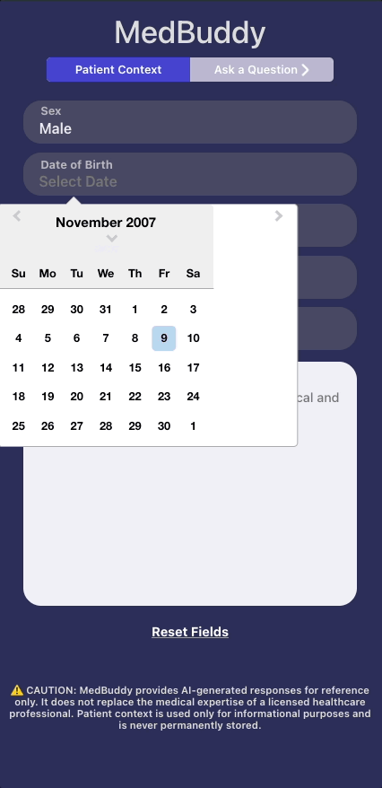
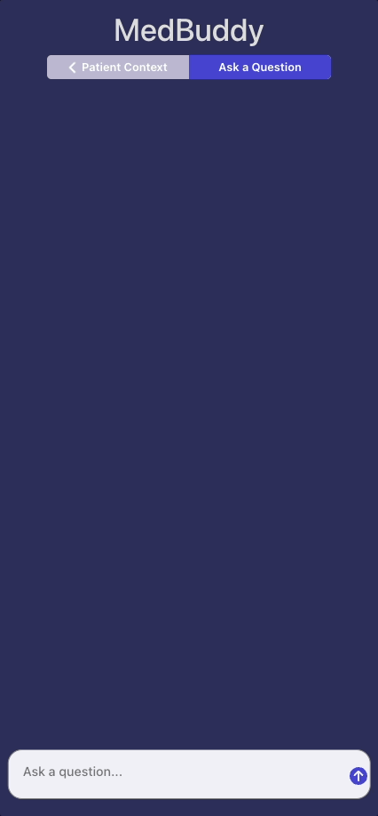

# med-buddy

An AI assistant designed for healthcare professionals, providing context-aware medical insights for everyday clinical decision making.

## Why I Built This

I created MedBuddy to help healthcare professionals streamline their decision making by providing context-aware insights. 

MedBuddy also allowed me to better understand the use of AI and API integration in web development, while ensuring compliance with HIPAA and ethical medical practice. 

## Live Demo
Try the application live at [https://med-buddy-chat.vercel.app/]

## Technologies Used

- React
- TypeScript
- CSS
- OpenAI API (https://openai.com/api/)

## Features
- User can enter data in patient context form
- User can switch views between the form and the chatbot
- User can send and receive messages

## Preview

## Stretch Features
- User can create new chatlogs
- User can access or delete old chatlogs

